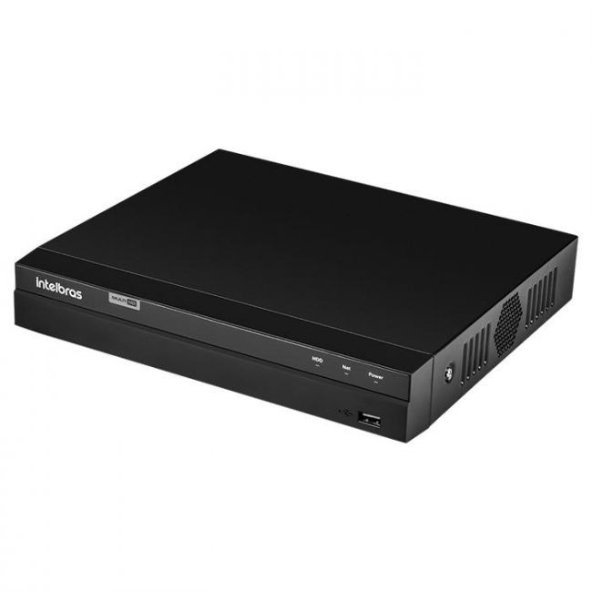
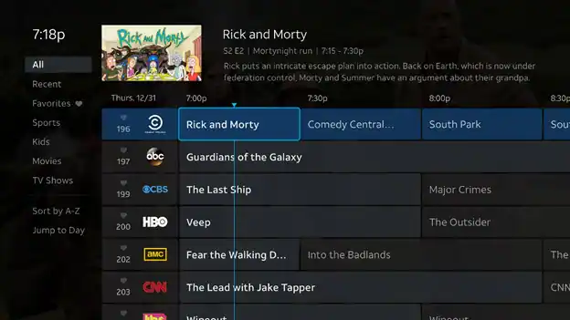

# MANUAL - DVR *Zony Xperience 2000*

- [MANUAL - DVR *Zony Xperience 2000*](#manual---dvr-zony-xperience-2000)
  - [INTRODUCTION](#introduction)
    - [What is a DVR?](#what-is-a-dvr)
  - [Section 1 - DVR Playback](#section-1---dvr-playback)
  - [Section 2 - How to Record a TV Show](#section-2---how-to-record-a-tv-show)

## INTRODUCTION
Welcome to the marvelous world of DVR owners. From this day forward, you will never again be the joke at gatherings just because you have missed the last episode of that TV show you don't even like, or the finals for that *whatsitcalled* sport that your father-in-law insists on watching.

This will never happen to you again because now you are a proud owner of a **Zony Xperience 2000 DVR** the future of entertainment[^1]!

[^1]: According to a very expensive study that we financed.

### What is a DVR?
A DVR (Digital Video Recorder) is a device used to record and store television programs or video signals (analogic or digital). 

It allows you to watch, pause, rewind, and record live TV broadcasts. It is just like magic, but better. Here's a general guide on how to use your brand-new device!

## Section 1 - DVR Playback

Now that you are all set up,
let's get started on your *Zony Xperience 2000*.
With the channels detected, you will be able to navigate through the TV guide. Let's start with something simple:

1. Navigate through the TV Guide.
   *  Using the *ARROWS* on your controller, choose the TV show you want to watch.
   * Press the *ACTION* button on your controller to watch the TV show. While watching the show, you will be able to control everything you see.
1. Your mother asked you to get her a glass of water. Pause the show, it will be waiting for you once you get back.
   * Press the *PAUSE* button in the central area of the controller.
   * Once you return, press *PLAY* and resume your show.
1. If you missed something because you had to answer a phone call, you can just rewind and watch it again!
   * Press the *REWIND* button.
1. Have you already watched this part? fast-forward to the part you want to watch.
     * Press *FAST-FORWARD* to advance
      > It will only work with recorded parts. It will not work if the feed is live. You can go back, but you can't see the future yet.
1. Let's stop for a moment before we learn how to record.
   * Press *STOP* to stop the show and return to the main screen.

## Section 2 - How to Record a TV Show
One of the most important features of your *DVR Zony Xperience 2000* is to record the TV shows you want, whenever you want, just to watch them later, watch them repeatedly, or not watch them at all! You can even record and delete shows that you will never watch! Here's how you do it:
1. Find the show you want to record.
   * Use the *ARROWS* on your controller to navigate and select the desired show.
   * Press and hold *ACTION* for 2 seconds to open the side menu.
1. Start immediate recording or schedule a recording:
   * Choose *RECORD*.
   * Select *YES* if you want to start the recording immediately.
     >It is recommended to start recording a TV Show a few minutes before the show starts. It will guarantee that you will not run into trouble and miss part of the show.
   * Select *NO* if you want to schedule a recording. 
     * Select the date and time using the side menu.
     * Select *SAVE* to confirm.
     * The DVR will start recording the channel you selected at the chosen date and time.
1. Access recorded shows:
   * Press *MENU* to open the menu.
   * Select *Recorded shows*.
1. Watch a recorded show:
   * Navigate back to the menu.
   * Select *RECORDED SHOWS*
   * Find the desired file and press *ACTION* to start watching.
1. Delete a recorded show:
   * Hold *ACTION* for 3 seconds and select *DELETE*.
    * A side menu will open, select *DELETE* to confirm or *CANCEL* to go back to the menu screen.

 

[Go to TechWritingExercise2.md](../TechWritingExercise2/TechWritingExercise2.md)

[Go to TechWritingExercise3.md](../TechWritingExercise3/TechWritingExercise3.md)
